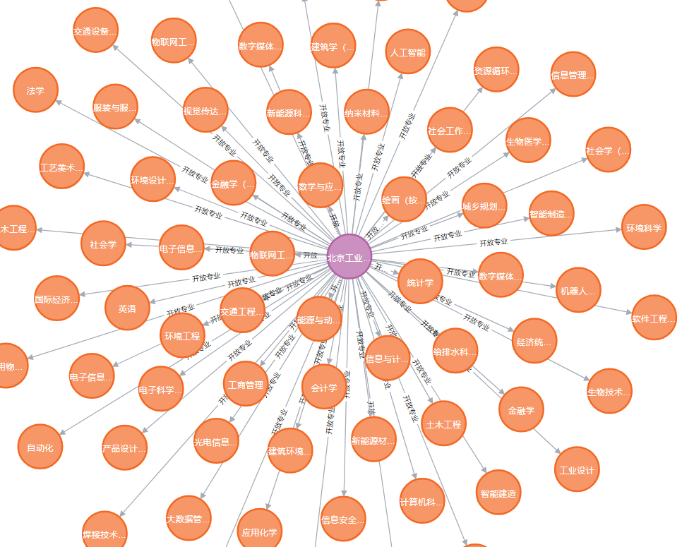

### 构建学校知识图谱

1. 爬虫抓高校数据
   
   - 爬取的目标网站选定为掌上高考(https://www.gaokao.cn)
   
   - 爬虫任务分析
     
     - 任务一：需要获取中国所有的高校列表，然后通过该列表对每一所具体院校爬取数据
     
     - 任务二：针对单一院校需要获取如下信息：
     
       - 学校开设专业及专业信息(专业名称、层次、学科门类、专业类别、学制等)

2. 高校数据持久化

3. 高校数据知识图谱创建
  
