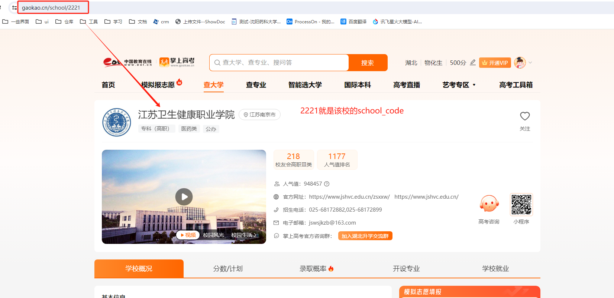
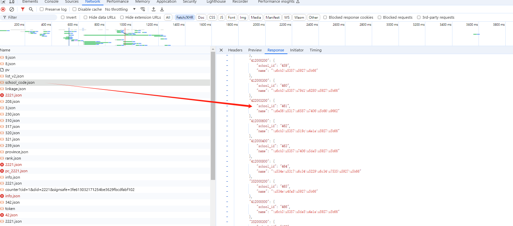
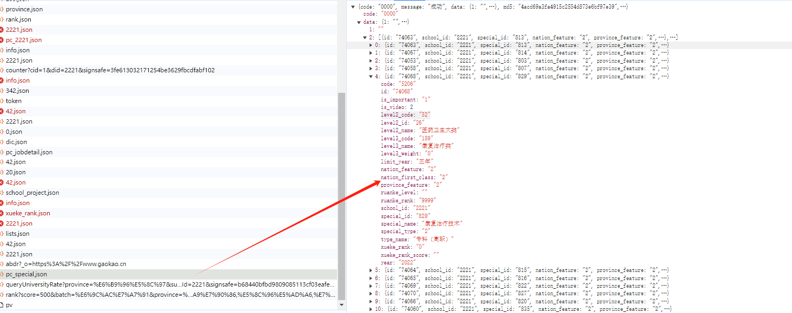

### 爬虫任务分析

1. 学校的详情界面一个通过改变`school_code`来遍历
   
   

2. 通过分析界面发现学校名称与code存储在一个静态json文件中。(`https://static-data.gaokao.cn/www/2.0/school/school_code.json`)
   
   

3. 学校的专业信息也存储在静态的文件中
   
   

4. 其他信息可以通过上述信息在界面上解析获得，此处不一一说明。
